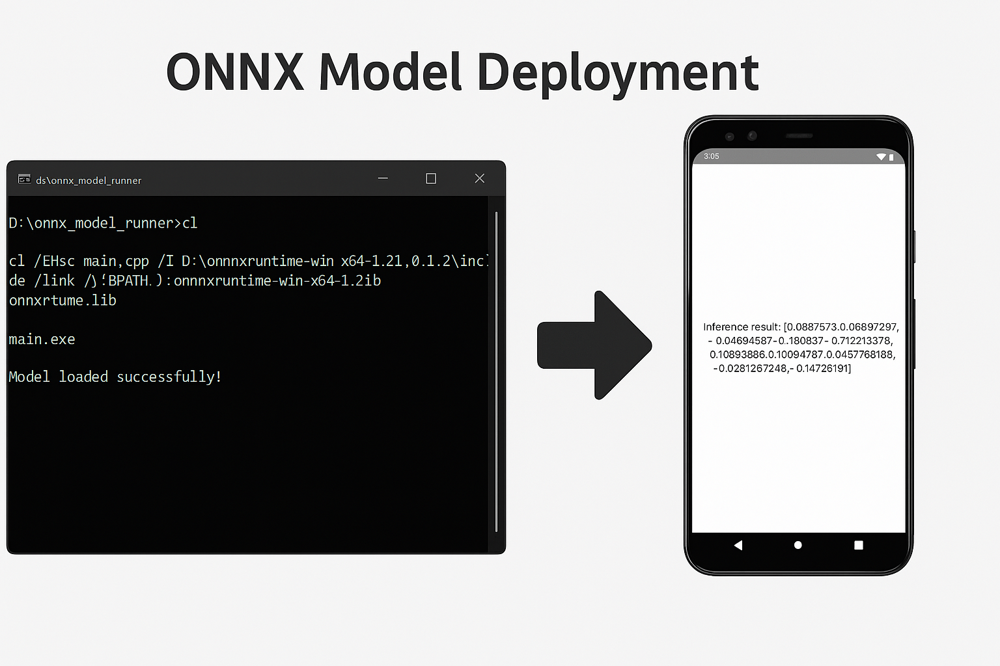

<h1 align="center"> ONNX Model Deployment </h1>

<p align="center">
  
</p>

This project demonstrates **how to deploy a CNN model in ONNX format** across two platforms:
-  **Windows (C++ runtime using ONNX Runtime)**
-  **Android (Native Kotlin + ONNX Runtime for Android)**


---

##  Folder Structure

```
onnx_model_runner/
├── mnist_opset11.onnx          # The final ONNX model (opset 11)
├── windows_cpp_runner/         # Windows/C++ deployment code
│   └── main.cpp
│   └── main.exe
│   └── main.obj
│   └── model.onnx
│   └── onnxruntime.dll
├── Android/                    # Android Studio project
│   └── [All Java/Kotlin files, assets/ folder, layout, gradle etc.]
```

---

##  Part 1: Deploy ONNX in Windows (C++)

###  Prerequisites

- Install Visual Studio Build Tools 2019
- Download ONNX Runtime (e.g., [onnxruntime-win-x64-1.21.0.zip](https://github.com/microsoft/onnxruntime/releases))
- Extract to: `D:\onnxruntime-win-x64-1.21.0`

###  main.cpp

```cpp
#include <iostream>
#include <onnxruntime_cxx_api.h>

int main() {
    Ort::Env env(ORT_LOGGING_LEVEL_WARNING, "ONNXApp");
    Ort::SessionOptions session_options;
    session_options.SetIntraOpNumThreads(1);

    Ort::Session session(env, L"model.onnx", session_options);  // Wide string for Windows
    std::cout << "Model loaded successfully!" << std::endl;

    return 0;
}
```

###  Build Command (ss1)

```bash
cl /EHsc main.cpp /I D:\onnxruntime-win-x64-1.21.0\include /link /LIBPATH:D:\onnxruntime-win-x64-1.21.0\lib onnxruntime.lib
```

###  Expected Output

```
Microsoft (R) C/C++ Optimizing Compiler Version 19.29.30159 for x64
main.cpp
Microsoft (R) Incremental Linker Version 14.29.30159.0
/out:main.exe
/LIBPATH:D:\onnxruntime-win-x64-1.21.0\lib
onnxruntime.lib
main.obj

D:\onnx_model_runner>main.exe
Model loaded successfully!

```

##  Part 2: Deploy ONNX on Android

###  Requirements

- Android Studio
- ONNX Runtime for Android

```gradle
implementation("com.microsoft.onnxruntime:onnxruntime-android:1.15.1")
```

###  Model

We use a simple CNN trained on MNIST and exported manually to `mnist_opset11.onnx` using:

```python
torch.onnx.export(model, dummy_input, "mnist_opset11.onnx", opset_version=11, ...)
```

###  Assets Folder

Place `mnist_opset11.onnx` in:

```
Android/app/src/main/assets/mnist_opset11.onnx
```

###  Inference Code (`MainActivity.kt`)

Loads model, prepares dummy input (1x1x28x28), and prints output scores.

📲 App UI:
- Shows `Inference result: [...]` on a blank 28x28 dummy image.

> 📸 **Screenshot**  


---

##  Summary

- [x] C++ ONNX inference 
- [x] Android ONNX deployment 

---

##  To Run

### Windows

```bash
main.exe
```

### Android

- Open project in Android Studio
- Click ▶ Run on Emulator or Device

---

##  Author

**Jyotishman Das**  
M.Tech Artificial Intelligence – IIT Jodhpur  

- [Portfolio](https://my-portfolio-jyotishman-das-projects.vercel.app)  
- [LinkedIn](https://www.linkedin.com/in/jyotishmandas85p/)

